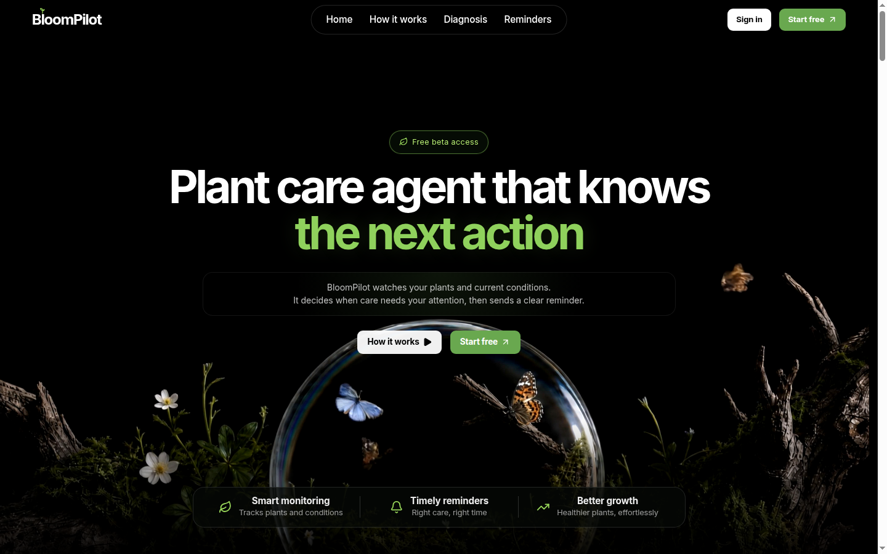

# 🌿 BloomPilot

**The AI operating system for modern home gardening.**

BloomPilot watches your plants and current conditions, decides when care needs your attention, and sends a clear reminder — backed by a real multi-agent reasoning pipeline, not a static rules list.

<p align="center">
  
</p>

<p align="center">
  <a href="https://bloompilot.vercel.app"><strong>🔗 Live Demo</strong></a>
</p>

<p align="center">
  
  
  
  
  
  
  
  
  
  
</p>

---

## Table of Contents

- [What BloomPilot Does](#what-bloompilot-does)
- [Features](#features)
- [Tech Stack](#tech-stack)
- [Agent Architecture](#agent-architecture)
  - [The 7-node pipeline](#the-7-node-pipeline)
  - [The ReAct care planner](#the-react-care-planner)
  - [Guardrails against agent failure modes](#guardrails-against-agent-failure-modes)
  - [Evidence grounding](#evidence-grounding)
  - [Deterministic fallback](#deterministic-fallback)
- [Production Hardening](#production-hardening)
- [Evaluation](#evaluation)
- [Project Structure](#project-structure)
- [Database Schema](#database-schema)
- [API Surface](#api-surface)
- [Running Locally](#running-locally)
- [Environment Variables](#environment-variables)
- [Deploying to Production](#deploying-to-production)
- [CI/CD](#cicd)

---

## What BloomPilot Does

BloomPilot is not a plant database with reminders bolted on. Every recommendation it makes is generated by combining **real, live data** — the user's saved plant setup, live weather (Open-Meteo), species care knowledge (Perenual/Trefle APIs), photo-based plant ID (PlantNet/iNaturalist/GBIF), disease diagnosis (Kindwise) — and then reasoning over that data with an LLM agent that has to justify every action with evidence before it's shown to the user.

The product goal is to turn garden context, weather, care history, and plant knowledge into guidance that's specific to *this* user's *actual* setup — not generic gardening advice.

## Features

- **Authentication & onboarding** — email/password auth, location + garden-type + reminder-channel setup
- **Plant collection** — add plants by photo (PlantNet vision) or name search (iNaturalist/GBIF), with care history, notes, and milestones
- **Daily care plan** — a live multi-agent pipeline generates today's actions, watering forecast, and weather-risk calendar
- **Photo diagnosis** — upload a photo of a struggling plant; Kindwise-backed disease diagnosis with confidence-gated findings
- **Garden Studio** — 3D placement planning (React Three Fiber) with sun-zone guidance
- **Reminders** — push, email (Resend), and Telegram delivery, gated by reminder window, confidence, and per-plant/per-day suppression rules
- **Conversational assistant** — read-only chat grounded in the user's real workspace snapshot
- **Stats & history** — garden health trends, care-plan history, CSV/JSON export
- **Weekly digest & alert observer** — anomaly detection across the garden, delivered on a schedule

## Tech Stack

| Layer | Choice |
|---|---|
| Framework | Next.js 16 (App Router, Server Components, Server Actions) |
| UI | React 19, Tailwind CSS 4, Radix UI, Framer Motion, Mantine |
| 3D | React Three Fiber / drei (Garden Studio) |
| Language | TypeScript (strict) |
| Agent orchestration | LangChain Core + LangGraph (`StateGraph`) |
| LLM | OpenAI (`gpt-4.1-mini`, tool-calling) |
| Database | Turso (libSQL) — SQLite-compatible, edge-replicated, serverless-safe |
| Validation | Zod (all API route bodies) |
| Rate limiting | Upstash Redis (sliding-window, opt-in) |
| Error tracking | Sentry (opt-in) |
| Email | Resend |
| Push | Web Push (VAPID) |
| Messaging | Telegram Bot API |
| External data APIs | Open-Meteo (weather), PlantNet (vision ID), Perenual + Trefle (species knowledge), Kindwise (disease diagnosis), iNaturalist + GBIF (taxonomy search) |
| Hosting | Vercel (Hobby, free tier) |
| CI/CD | GitHub Actions (build gate + scheduled cron jobs) |

## Agent Architecture

### The 7-node pipeline

The care-plan pipeline (`src/lib/agent-graph.ts`) is a LangGraph `StateGraph` with seven nodes, each contributing a piece of state and an auditable trace:

```
Context Builder → Environment → Plant Knowledge → ReAct Care Planner → Evidence → Reminder → Dashboard
```

| Node | Responsibility |
|---|---|
| **Context Builder** | Loads the user's saved plants, location, garden type, and studio layout into a unified snapshot |
| **Environment** | Pulls live weather (Open-Meteo), computes risk flags (frost, heat, high UV, heavy rain) |
| **Plant Knowledge** | Resolves per-species care baselines (Perenual/Trefle, cached in Turso, seeded fallback) |
| **ReAct Care Planner** | The only node that does real LLM reasoning — see below |
| **Evidence** | Validates every action has a non-empty reason and at least one evidence reference before approval |
| **Reminder** | Computes channel readiness and confidence-gated delivery eligibility |
| **Dashboard** | Assembles the final `CarePlanOutput` consumed by the UI |

Every node emits a structured trace (agent name, input, output, evidence sources) — the dashboard's "Agent Activity" view is a real, unmocked log of what each node actually did on that run, not a canned demo.

### The ReAct care planner

`src/lib/care-planner-react.ts` runs a genuine tool-calling loop against OpenAI, not a single completion:

- **Tools available to the model:** `get_health_history`, `get_plant_knowledge`, `get_action_feedback`, `propose_watering_adjustment`, `submit_care_plan`
- **Loop bound:** `MAX_ITERATIONS = 10`, plus an independent 60-second wall-clock budget so a slow/looping run can't hang indefinitely regardless of per-call timeouts
- The model must call `submit_care_plan` with a complete, valid action list to finish; partial or invalid submissions get a corrective tool response and another turn, rather than silently failing

### Guardrails against agent failure modes

Built and tested against the concrete ways an LLM agent goes wrong in production, not just the happy path:

- **Stuck/repeated tool calls** — the same tool called with the same arguments twice gets told to stop instead of silently re-executing toward the iteration cap
- **Partial submissions corrupting the loop** — a `submit_care_plan` call with some invalid actions used to fall through into an unrecognized-tool error, breaking the OpenAI conversation transcript; now it loops back for a corrected submission
- **Silently dropped safety actions** — the fallback-merge logic used to exclude *any* rule-based action for a plant the LLM mentioned at all; now it only skips true duplicates, so a frost-risk plant can't lose its protection action just because the LLM submitted an unrelated watering action for it
- **Unearned confidence** — an action whose evidence falls back to a generic plant-identity statement (no real match for the requested action type — no active frost flag for a "protect" action, etc.) has its confidence capped, so it can't reach the reminder-delivery confidence gate on the strength of a hallucination-shaped guess
- **Observability on every failure mode above** — structured logging fires when the fallback engages, the iteration cap is hit without a submission, or a repeated-call loop is detected, so these are visible events, not silent degradation

### Evidence grounding

Every care action carries `evidence_refs` — typed references back to what actually produced it (saved plant context, live weather reading, tool-call results). The evidence layer was specifically audited for the failure mode where an LLM's own stated reason is treated as its own evidence (tautological validation); the fix caps confidence on any action whose evidence didn't match a real, type-specific data point for that action.

### Deterministic fallback

If the LLM call fails outright, `buildRawCareActions` (a rule-based engine using the same saved context and live weather evidence) produces a plan in the exact same `CarePlanOutput` shape, so downstream consumers — dashboard, reminders, exports — can't tell the difference and don't break.

## Production Hardening

This started as a prototype and was hardened into something closer to production-grade over the course of the project:

- **Multi-tenant data isolation** — every query touching per-user data is scoped to the session-derived user id; audited end-to-end, no client-controlled `userId` is ever trusted
- **Request validation** — Zod schemas on every API route that accepts a body, replacing ad-hoc manual checks
- **Consistent error handling** — a shared `withApiHandler` wrapper across all 49 API routes: thrown errors are logged with request context and turned into a consistent JSON 500 instead of bubbling into a raw crash
- **Rate limiting** — Upstash Redis sliding-window limits on auth actions (sign-up/sign-in/password-reset), the LLM-calling routes (care-plan generation, chat, knowledge enrichment), and the two fully public external-API routes (plant photo ID, plant search) that are the real bill-risk surface
- **Structured logging + error tracking** — a JSON structured logger wired to forward warnings/errors to Sentry automatically once configured, no per-call-site changes needed
- **Timeouts everywhere** — every outbound call to OpenAI, PlantNet, Perenual, Trefle, Kindwise, and Open-Meteo has an explicit timeout

## Evaluation

`eval/` contains a real, non-mocked evaluation harness for the agent pipeline: Playwright-driven account creation across multiple real-world locations (for genuinely different live weather), objective code-based checks (schema validity, evidence-source grounding against a programmatically-extracted allow-list, referential integrity, duplicate detection, weather-consistency rules), an independent timezone cross-check that recomputes reminder-window logic without reusing app code, and API robustness probes. No LLM-as-judge, no human labeling — see `eval/README.md` and `eval/results/EVAL_REPORT.md`.

## Project Structure

```
src/
  app/
    (auth)/            sign-in, sign-up, onboarding, preferences
    (app)/              protected app shell — dashboard, garden, diagnosis, tasks, reminders, stats, settings
    api/                49 route handlers — see API Surface below
    garden-studio/      3D placement planning experience
    global-error.tsx    root error boundary (Sentry-integrated)
  components/
    home/                landing page sections
    dashboard/           care-plan dashboard rendering
    plants/              plant add/edit workflow
    layout/              app shell, navigation
    ui/                  shared design primitives
  lib/
    agent-graph.ts        LangGraph pipeline definition
    care-planner-react.ts ReAct tool-calling loop
    care-plan-engine.ts   care-plan generation, evidence validation, reminder readiness
    context-builder.ts    unified garden-context snapshot builder
    database.ts            Turso/libSQL driver + schema
    api-handler.ts         shared route error-handling + zod validation wrapper
    rate-limit.ts           Upstash-backed rate limiter (no-ops until configured)
    logger.ts               structured logger, Sentry-integrated
    reminders.ts             reminder selection, suppression, delivery
    diagnosis.ts             photo-based diagnosis pipeline
  instrumentation.ts, sentry.*.config.ts   Sentry wiring
eval/                       agent evaluation harness
services/agent-service/      optional external FastAPI/LangGraph service (not used in production)
.github/workflows/           CI + scheduled cron jobs
```

## Database Schema

Turso (libSQL) — SQLite-compatible, schema auto-initializes on first connection (`src/lib/database.ts`):

`users`, `plants`, `care_tasks`, `activities`, `care_plans`, `diagnosis_runs`, `plant_health_events`, `plant_notes`, `plant_milestones`, `plant_alerts`, `plant_evidence`, `plant_species_knowledge`, `garden_context_snapshots`, `studio_layouts`, `reminder_runs`, `reminder_deliveries`, `notification_subscriptions`, `action_feedback`, `agent_runs`, `agent_traces`, `seasonal_recommendations`, `password_reset_tokens`.

## API Surface

<details>
<summary>All 49 API routes (click to expand)</summary>

**Context & care plan**
`GET /api/dashboard` · `GET /api/context/current` · `POST /api/context/build` · `GET /api/care-plan/current` · `POST /api/care-plan/generate` · `GET /api/care-plan/stream` (SSE) · `GET /api/care-plan/history` · `GET /api/care-plan/history/[id]` · `GET /api/care-plan/export` · `GET /api/readiness/strict`

**Plants & garden**
`GET|POST /api/plants` · `GET|PUT|DELETE /api/plants/[plantId]` · `POST /api/plants/detect` · `GET /api/plants/search` · `POST /api/plants/log-care` · `POST|GET|HEAD|DELETE /api/plants/photo` · `GET /api/plants/health` · `GET /api/plants/trend` · `GET|POST|DELETE /api/plants/notes` · `GET|POST|DELETE /api/plants/milestones` · `GET /api/plant-image`

**Diagnosis**
`GET|POST /api/diagnosis/analyze` · `GET /api/diagnosis/runs` · `GET /api/diagnosis/by-plant` · `GET /api/diagnosis/photo/[runId]`

**Reminders & notifications**
`GET /api/reminders/cron` · `GET /api/reminders/escalation` · `POST /api/reminders/run` · `POST /api/notifications/push/subscribe` · `POST /api/notifications/push/unsubscribe` · `POST /api/telegram/webhook`

**Garden Studio & knowledge**
`GET|POST /api/garden-studio/layout` · `GET|POST /api/knowledge` · `GET|POST /api/seasonal`

**Tasks & feedback**
`GET /api/tasks` · `POST /api/tasks/[taskId]/toggle` · `POST /api/tasks/batch` · `POST /api/feedback`

**Agent & workspace**
`GET /api/agent/brief` · `GET /api/agent/service/status` · `GET /api/workspace/state` · `GET /api/mobile/bootstrap` · `GET|POST /api/alerts` · `GET /api/chat`

**Supporting**
`GET /api/weather` · `GET /api/location/search` · `GET /api/location/reverse`

**Cron (scheduled, `CRON_SECRET`-protected)**
`GET /api/alerts/cron` · `GET /api/digest/cron`

</details>

## Running Locally

**Requirements:** Node.js ≥ 22

```bash
git clone https://github.com/adityasnehai/bloompilot.git
cd bloompilot
npm install
```

Create `.env.local` in the project root (see [Environment Variables](#environment-variables) for the full list). The minimum to boot the app:

```bash
SESSION_SECRET=<any random string>
```

Without `TURSO_DATABASE_URL`/`TURSO_AUTH_TOKEN` set, the app automatically falls back to a local SQLite file (`/tmp/bloompilot.sqlite`) — no Turso account needed for local development.

```bash
npm run dev
```

Open [http://localhost:3000](http://localhost:3000).

Other scripts:

```bash
npm run build   # production build
npm start       # run a production build locally
npm run lint    # eslint
npx tsc --noEmit  # type check
```

## Environment Variables

None of these are committed — `.env*` is gitignored (verified against full git history). Values shown are variable **names** only.

<details>
<summary>Core (required in production)</summary>

| Variable | Purpose |
|---|---|
| `SESSION_SECRET` | Cookie session signing — **required in production**, app throws on boot without it |
| `TURSO_DATABASE_URL` | Turso database URL — [console.turso.tech](https://console.turso.tech) |
| `TURSO_AUTH_TOKEN` | Turso auth token |
| `CRON_SECRET` | Bearer-auth secret protecting cron endpoints |

</details>

<details>
<summary>AI / external data APIs</summary>

| Variable | Purpose | Get it at |
|---|---|---|
| `OPENAI_API_KEY` | Powers the ReAct care planner, alert observer, chat | [platform.openai.com/api-keys](https://platform.openai.com/api-keys) |
| `OPENAI_MODEL` | Model name (defaults to `gpt-4.1-mini`) | — |
| `PLANTNET_API_KEY` | Photo-based plant identification | [my.plantnet.org](https://my.plantnet.org/) |
| `PERENUAL_API_KEY` | Species care knowledge | [perenual.com/docs/api](https://perenual.com/docs/api) |
| `TREFLE_API_KEY` | Species care knowledge (secondary source) | [trefle.io](https://trefle.io/) |
| `KINDWISE_API_KEY` | Photo-based disease diagnosis | [kindwise.com](https://www.kindwise.com/) |

</details>

<details>
<summary>Notifications</summary>

| Variable | Purpose | Get it at |
|---|---|---|
| `RESEND_API_KEY` | Transactional email | [resend.com/api-keys](https://resend.com/api-keys) |
| `RESEND_FROM_EMAIL` | Verified sender address | — |
| `WEB_PUSH_VAPID_PUBLIC_KEY` / `WEB_PUSH_VAPID_PRIVATE_KEY` | Browser push notifications | `npx web-push generate-vapid-keys` |
| `NEXT_PUBLIC_WEB_PUSH_VAPID_PUBLIC_KEY` | Same public key, client-exposed | — |
| `WEB_PUSH_CONTACT_EMAIL` | VAPID subject contact | — |
| `TELEGRAM_BOT_TOKEN` | Telegram reminder delivery | [t.me/BotFather](https://t.me/BotFather) |
| `TELEGRAM_BOT_USERNAME` | Bot username, used to build the connect link | — |
| `TELEGRAM_CONNECT_SECRET` / `TELEGRAM_WEBHOOK_SECRET` | Telegram link/webhook signing secrets | any random string |

</details>

<details>
<summary>Opt-in production hardening (app runs fine without these — they no-op until set)</summary>

| Variable | Purpose | Get it at |
|---|---|---|
| `UPSTASH_REDIS_REST_URL` / `UPSTASH_REDIS_REST_TOKEN` | Enables rate limiting | [console.upstash.com](https://console.upstash.com/) |
| `SENTRY_DSN` / `NEXT_PUBLIC_SENTRY_DSN` | Enables error tracking | [sentry.io/signup](https://sentry.io/signup/) |
| `SENTRY_AUTH_TOKEN` / `SENTRY_ORG` / `SENTRY_PROJECT` | Enables unminified stack traces in Sentry (optional) | Sentry → Settings → Auth Tokens |

</details>

<details>
<summary>App config / misc</summary>

`NEXT_PUBLIC_APP_NAME`, `NEXT_PUBLIC_APP_TAGLINE`, `NEXT_PUBLIC_APP_DESCRIPTION`, `NEXT_PUBLIC_SITE_URL`, `NEXT_PUBLIC_SUPPORT_EMAIL`, `SESSION_COOKIE_NAME`, `GARDEN_COOKIE_NAME`, `STRICT_PRODUCTION_MODE` — all have sane defaults; only worth setting to customize branding or force strict evidence-gating.

</details>

## Deploying to Production

The live deployment (100% free tier, no credit card anywhere) uses:

- **[Vercel](https://vercel.com)** (Hobby plan) — hosting, auto-deploy on push to `main`
- **[Turso](https://turso.tech)** (free tier) — production database, 5GB storage, no auto-pause
- **[GitHub Actions](https://github.com/features/actions)** — CI build gate + the two cron jobs Vercel Hobby's once-daily cron limit can't cover (hourly reminders, 4-hourly alerts)

Steps:

1. Create a Turso database, get `TURSO_DATABASE_URL` + `TURSO_AUTH_TOKEN`.
2. Import the repo on Vercel. If the import wizard shows a "multiple services" prompt, switch the Application Preset to a single Next.js app (`.vercelignore` already excludes the unrelated `eval/` harness).
3. Add all env vars from the tables above to Vercel (Production scope).
4. Deploy.
5. In GitHub → repo Settings → Secrets and variables → Actions, add `PROD_URL` (your live URL) and `CRON_SECRET` (same value as in Vercel) so `.github/workflows/cron.yml` can authenticate.

`vercel.json` only schedules the two once-daily-or-less cron jobs (weekly digest, daily escalation) — Vercel Hobby caps cron at once/day, so the higher-frequency jobs run via GitHub Actions instead.

## CI/CD

- **`.github/workflows/ci.yml`** — on every push/PR to `main`: `npm ci` → `tsc --noEmit` → `eslint` → `next build`. No secrets required — the build has no hard dependency on live credentials.
- **`.github/workflows/cron.yml`** — scheduled: hourly reminders sweep, 4-hourly alert observer sweep, authenticated via `CRON_SECRET` against `PROD_URL`.
- Deployment itself is handled natively by Vercel's GitHub integration on every push to `main` — no separate deploy workflow needed.
